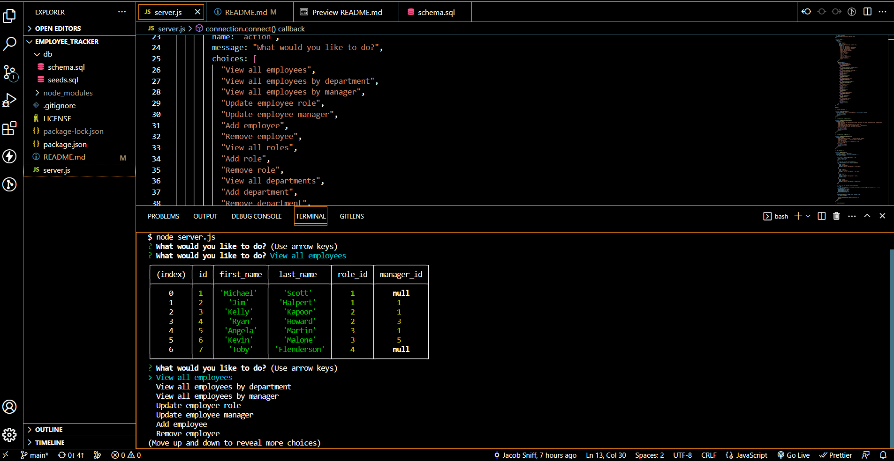

# Employee_Tracker

  

## Description

  This application's goal is to keep your employees and departments organized by placing them in a database table.

## Table of Contents

- [Installation](#installation)
- [Usage](#usage)
- [Contributing](#contributing)
- [Tests](#tests)
- [License](#license)
- [Questions](#questions)

## Installation

  Just ensure you have the right packages needed. Go into your CLI and type in 'npm i'.

## Usage

  When you have the application running go into the CLI and start the series of prompts by typing 'server.js'. Once you have done this you will be able to choose from a series of prompts that will allow you to see all employees, add and employee, see departments, add departments, remove employee or department, etc.

  
  
## License

This project is licensed under the terms of the [MIT license](https://opensource.org/licenses/MIT).
    

## Questions

  If you have any questions, concerns, or comments please reachout to me on [Github](https://github.com/J-Sniff or at JacobSniff18@gmail.com).
